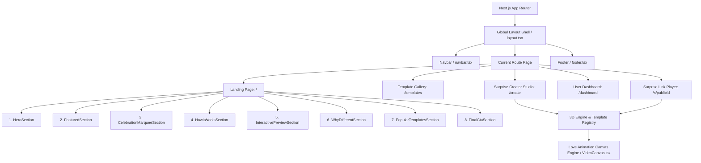

# Website Architecture & Section-by-Section Editing Guide

> **Partner in Crime — Interactive Surprise Platform**  
> Complete reference manual for understanding each section, page, engine component, and how to edit them.

---

## 1. High-Level System Architecture

---

## 2. Global Shell & Navigation

Wrapped by [`components/layout/layout-wrapper.tsx`](file:///f:/Interactive%20Surprise%20Platform/components/layout/layout-wrapper.tsx).  
*Note: Public recipient surprises (`/s/...`) and Admin CMS (`/admin/...`) automatically switch to distraction-free full-screen mode.*

| Component | File Path | Description & Controls | Key Things to Edit |
| :--- | :--- | :--- | :--- |
| **Root Layout** | [`app/layout.tsx`](file:///f:/Interactive%20Surprise%20Platform/app/layout.tsx) | HTML head, SEO metadata, fonts (`GeistSans`, `GeistMono`), `ThemeProvider`, `AuthProvider`. | SEO title, open-graph cards, theme defaults. |
| **Navbar** | [`components/layout/navbar.tsx`](file:///f:/Interactive%20Surprise%20Platform/components/layout/navbar.tsx) | Sticky top navigation bar, logo, links, theme switch, dashboard/login CTA. | Links (`NAV_LINKS`), action buttons, mobile menu drawer. |
| **Footer** | [`components/layout/footer.tsx`](file:///f:/Interactive%20Surprise%20Platform/components/layout/footer.tsx) | Bottom site footer, newsletter, quick links, legal info, copyright. | Copyright notice, social links, footer columns. |

---

## 3. Homepage (`app/page.tsx`) Section Breakdown

All landing page sections are rendered sequentially inside [`app/page.tsx`](file:///f:/Interactive%20Surprise%20Platform/app/page.tsx):

### 🌟 Section 1: Hero Section
- **File**: [`components/home/HeroSection.tsx`](file:///f:/Interactive%20Surprise%20Platform/components/home/HeroSection.tsx)
- **Visuals**: RetroGrid ambient wireframe, dynamic celebration particles (`magicui/particles`), badge, glowing title, confetti blast trigger, orbiting celebration icons.
- **How to Edit**:
  - Main headline & subtitle: Lines 59–75 (pulls defaults from `lib/constants.ts`).
  - Action buttons: "Create a Surprise" & "Explore Templates".
  - Particle count / Confetti colors: Modify `colors: ["#ec4899", ...]` in `triggerConfetti()`.

### 🎁 Section 2: Featured 3D Experiences
- **Files**: [`components/home/FeaturedSection.tsx`](file:///f:/Interactive%20Surprise%20Platform/components/home/FeaturedSection.tsx) & [`components/home/Featured3DCard.module.css`](file:///f:/Interactive%20Surprise%20Platform/components/home/Featured3DCard.module.css)
- **Visuals**: Interactive 3D tilt cards showcasing flagship templates (*Sweet Celebration 💌*, *Magic Gift 🎁*, *Birthday Cake 🎂*).
- **How to Edit**:
  - `TEMPLATE_META` dictionary (lines 28–120): Badges, gradients, action icons, glow colors.
  - Tilt & card lighting: CSS in `Featured3DCard.module.css`.

### 💬 Section 3: Celebration Marquee (Testimonials)
- **File**: [`components/home/CelebrationMarqueeSection.tsx`](file:///f:/Interactive%20Surprise%20Platform/components/home/CelebrationMarqueeSection.tsx)
- **Visuals**: Infinite horizontal scrolling testimonials with customer avatars, star ratings, and real emotion tags.
- **How to Edit**:
  - Testimonial cards: `TESTIMONIALS_ROW_1` & `TESTIMONIALS_ROW_2` (names, quotes, avatars, tags).
  - Speed/pause: Props on `<Marquee />`.

### 🛠️ Section 4: How It Works
- **File**: [`components/home/HowItWorksSection.tsx`](file:///f:/Interactive%20Surprise%20Platform/components/home/HowItWorksSection.tsx)
- **Visuals**: 3-step numbered cards:
  1. *Choose a 3D World*
  2. *Add Secret Memories*
  3. *Send The Magic Link*
- **How to Edit**:
  - `steps` array (lines 6–31): Edit titles, descriptions, step numbers, and Lucide icons.

### 🎮 Section 5: Interactive 3D Preview Player
- **File**: [`components/home/InteractivePreviewSection.tsx`](file:///f:/Interactive%20Surprise%20Platform/components/home/InteractivePreviewSection.tsx)
- **Visuals**: Interactive simulated experience player directly on the homepage (testing candles, envelope opening, and confetti live).
- **How to Edit**:
  - Simulated interactive states (envelope opened, candle extinguished, audio play).
  - Phone frame styling and background glow.

### ⚖️ Section 6: Why It's Different
- **File**: [`components/home/WhyDifferentSection.tsx`](file:///f:/Interactive%20Surprise%20Platform/components/home/WhyDifferentSection.tsx)
- **Visuals**: Side-by-side comparison: *Standard Text or E-Card* (Forgettable) vs. *Interactive Surprise* (Unforgettable Memory).
- **How to Edit**:
  - Checkmarks & 'X' comparison items: Lines 39–105.

### 🎨 Section 7: Popular Templates Gallery
- **File**: [`components/home/PopularTemplatesSection.tsx`](file:///f:/Interactive%20Surprise%20Platform/components/home/PopularTemplatesSection.tsx)
- **Visuals**: Category filter bar (`All`, `Birthday 🎂`, `Love & Romance 💖`, `Anniversary 🥂`, `Best Friend 🤝`) with direct "Customize" and "Live Demo" links.
- **How to Edit**:
  - `categories` array (lines 15–21).
  - Template catalog items in `lib/constants.ts`.

### 🚀 Section 8: Final Call to Action (CTA)
- **File**: [`components/home/FinalCtaSection.tsx`](file:///f:/Interactive%20Surprise%20Platform/components/home/FinalCtaSection.tsx)
- **Visuals**: 3D glossy SVG hearts, `AnimatedBeam` connections, high-conversion gradient CTA button.
- **How to Edit**:
  - Heading text, subtext, and guarantee badges ("No app download needed", "Instant Delivery").
  - `GlossyHeart` SVG colors and specular reflections.

---

## 4. Core Application Pages & Features

| Route | Main File | What It Does & Key Subcomponents |
| :--- | :--- | :--- |
| **Template Catalog** | [`app/templates/page.tsx`](file:///f:/Interactive%20Surprise%20Platform/app/templates/page.tsx) | Category filtering, search bar, sorting, template detail modal. Uses [`components/templates/TemplateCard.tsx`](file:///f:/Interactive%20Surprise%20Platform/components/templates/TemplateCard.tsx). |
| **Creator Studio** | [`app/create/page.tsx`](file:///f:/Interactive%20Surprise%20Platform/app/create/page.tsx) | Multi-step personalizer for recipient name, letter, photos, music trimmer, colors, and live preview. Subcomponents in [`components/creator/`](file:///f:/Interactive%20Surprise%20Platform/components/creator/). |
| **User Dashboard** | [`app/dashboard/page.tsx`](file:///f:/Interactive%20Surprise%20Platform/app/dashboard/page.tsx) | Manage created surprises, draft saving, view count analytics, share links, delete. |
| **Recipient Experience** | [`app/s/[publicId]/page.tsx`](file:///f:/Interactive%20Surprise%20Platform/app/s/[publicId]/page.tsx) | The live web experience delivered to the recipient. Uses [`PublicSurpriseClient.tsx`](file:///f:/Interactive%20Surprise%20Platform/components/experience/PublicSurpriseClient.tsx). |
| **Auth** | [`app/login/page.tsx`](file:///f:/Interactive%20Surprise%20Platform/app/login/page.tsx), [`app/signup/page.tsx`](file:///f:/Interactive%20Surprise%20Platform/app/signup/page.tsx) | Supabase auth integration with email/password and session state. |

---

## 5. Creator Studio Subcomponents (`components/creator/`)

- [`AudioTrimmerStudio.tsx`](file:///f:/Interactive%20Surprise%20Platform/components/creator/AudioTrimmerStudio.tsx): Waveform audio trimmer, preview playback, start/end markers, and preset audio picker.
- [`PhotoManager.tsx`](file:///f:/Interactive%20Surprise%20Platform/components/creator/PhotoManager.tsx): Photo upload, caption editing, polaroid styling, re-ordering.
- [`TemplatePersonalizeSection.tsx`](file:///f:/Interactive%20Surprise%20Platform/components/creator/TemplatePersonalizeSection.tsx): Form fields for custom message, sender/recipient names, date, and theme accents.
- [`StudioLiveCanvas.tsx`](file:///f:/Interactive%20Surprise%20Platform/components/creator/StudioLiveCanvas.tsx): Real-time interactive canvas preview matching recipient view.
- [`ShareModal.tsx`](file:///f:/Interactive%20Surprise%20Platform/components/creator/ShareModal.tsx): Copy link, QR code generator, WhatsApp/SMS direct sharing.

---

## 6. Template Engine & Specialized Canvas Engines

### A. 3D Engine Templates (`lib/engine/templates/`)
- `birthdayCakeTemplate.ts` — Interactive 3D birthday cake with blowable candle flame.
- `sweetCelebrationTemplate.ts` — Letterbox unboxing with typewriter letter & floating polaroids.
- `magicGiftTemplate.ts` — 3D gift box with ribbon unwrapping physics.
- `goldenProposalTemplate.ts` — Ring box opening with soft cinematic lighting.
- `balloonRoomTemplate.ts` — Interactive popping balloons.
- `rainbowSurpriseTemplate.ts` — Whimsical rainbow environment.

### B. Love Animation High-Performance Engine
- **Files**:
  - Main Component: [`public/templates/love-animation/src/components/VideoCanvas.tsx`](file:///f:/Interactive%20Surprise%20Platform/public/templates/love-animation/src/components/VideoCanvas.tsx)
  - Application Container: [`public/templates/love-animation/src/App.tsx`](file:///f:/Interactive%20Surprise%20Platform/public/templates/love-animation/src/App.tsx)
  - Audio Engine: [`public/templates/love-animation/src/utils/audio.ts`](file:///f:/Interactive%20Surprise%20Platform/public/templates/love-animation/src/utils/audio.ts)
- **Key Features in `VideoCanvas.tsx`**:
  - `createHeartSprite()`: Pre-renders high-res vector hearts on offscreen canvases for hardware-accelerated 60 FPS particle systems.
  - `drawTinyHeart()`: Parametric bezier heart math for crisp dynamic rendering.
  - Web Audio Synthesizer: Procedural background chords, notes, and interactive chime sounds.
  - Multi-slide transitions, floating polaroid photographs, glowing particles, and custom letter typing.

---

## 7. Global Configuration Quick Reference

- **Brand Constants & Template List**: [`lib/constants.ts`](file:///f:/Interactive%20Surprise%20Platform/lib/constants.ts)  
  *Contains `BRAND_NAME`, `BRAND_HEADLINE`, `BRAND_SUBTITLE`, `CATEGORIES`, and `MOCK_TEMPLATES`.*
- **Global Styles & Color Palette**: [`app/globals.css`](file:///f:/Interactive%20Surprise%20Platform/app/globals.css)  
  *Contains CSS variables, theme classes, animations, and Tailwind directives.*
